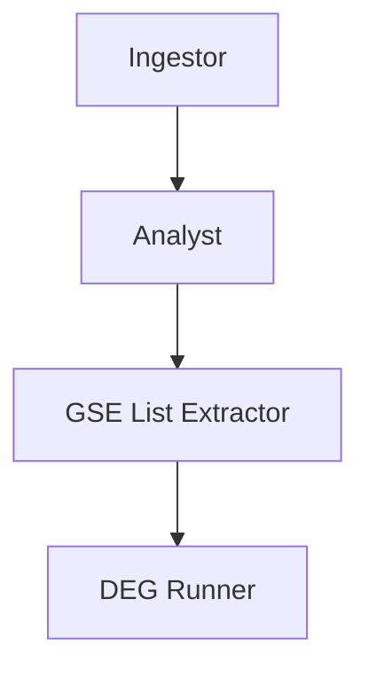

# 🔬 GEO Search and Analysis Agent

This project implements an **AI-integrated pipeline** for analyzing RNA-seq datasets from **NCBI GEO**. It automates the process from gene input → pathway/drug search → GEO dataset retrieval → differential expression analysis (DESeq2) using LangGraph-style agents and OpenAI models.

---

## 📌 Features

- 🔎 **Gene-Pathway Extraction** using GPT (`claude or gpt-4o-mini`)
- 🧚 **GEO dataset discovery** based on genes and pathway-related drugs
- 📅 **Automated metadata & count file download** via Geofetch and GEO HTML scraping
- 🧠 **LLM-assisted study design** (selects datasets with proper control vs treated conditions)
- 📊 **Differential gene expression (DEG)** analysis using DESeq2 (via `pydeseq2`)
- ⟳ Fully **state-driven agent pipeline** using LangGraph structure

---

## 🧱️ Project Structure

```
project/
├── geofetch_metadata/           # Stores metadata from geofetch
├── rna_seq_analysis/            # Stores count files and DESeq2 results
├── your_script.py               # The main pipeline code
├── combined_metadata.csv        # Merged metadata file (autogenerated)
└── README.md
```

---

## ⚙️ Requirements

- Python ≥ 3.8
- Packages:
  - `pandas`, `numpy`, `openai`, `gseapy`, `bs4`, `requests`, `pydeseq2`, `langgraph`
  - `geofetch` (via CLI)
- Access to OpenAI API (key via `.env` or environment variable)

---

## 🚀 How It Works

### 1. Ingestor Agent

Takes a `query_gene` and:

- Calls LLM to find pathway-related **genes, drugs, biological processes**
- Searches GEO for RNA-seq datasets mentioning these items
- Downloads metadata and supplementary count files
- Saves a combined metadata CSV for downstream use

### 2. Analyst Agent

- Uses sample metadata + LLM to:
  - Identify drug-treated vs. control datasets
  - Recommend comparisons for DEG analysis
  - Generate a plain-text research plan

### 3. GSE List Extractor

- Extracts all GSE IDs mentioned in the research plan
- Adds them to the agent state for analysis

### 4. DEG Runner

- Loads raw count files and filtered metadata
- Infers conditions (`treated` vs `control`)
- Runs **DESeq2** analysis per GSE
- Saves CSV of DEG results per GSE

---

## 🧪 Usage

Update the workflow entry:

```python
initial_state = {"query_gene": ""}  # Replace with your gene of interest
final_state = graph.invoke(initial_state)
```

Check the results in `rna_seq_analysis/` and view the generated `research_plan` in the final state.

---

## 📂 Output Files

| File                    | Description                                            |
| ----------------------- | ------------------------------------------------------ |
| `combined_metadata.csv` | Combined metadata for all downloaded GSEs              |
| `*_raw_counts.csv`      | Count matrix per GSE (loaded manually or via scraping) |
| `*_deseq2_results.csv`  | DESeq2 differential gene expression results            |

---

## 🧠 AI Agent Pipeline (LangGraph)



Each agent updates the `AgentState` dict as it moves through the pipeline.

---

## 📝 Agent State Fields

```python
AgentState = TypedDict({
  query_gene: str,
  pathway_info: Dict,
  metadata: Dict,
  gse_list: List[str],
  research_plan: str,
  selected_gses: List[str],
  deg_results: Dict[str, str]
})
```

---

## 📅 Downloading Data

- **Geofetch metadata**: via `geofetch` CLI
- **Count matrices**: via scraping supplementary files (tar/gz) or Geofetch
- All files go to `rna_seq_analysis/` or `geofetch_metadata/`

---

## 🧪 Sample Prompt to LLM

```
The target gene is PTGS2, and the related drugs of interest are: 
Below is a preview of sample metadata...

Your task:
1. Identify treated vs. control samples
2. Recommend datasets for DE analysis
...
```

---

## 🛠️ Debugging

Enable detailed output using:

```python
workflow.add_node("DEGRunner", RunnableLambda(run_deg_for_multiple_gses_debug))
```

---

## 📌 TODO


